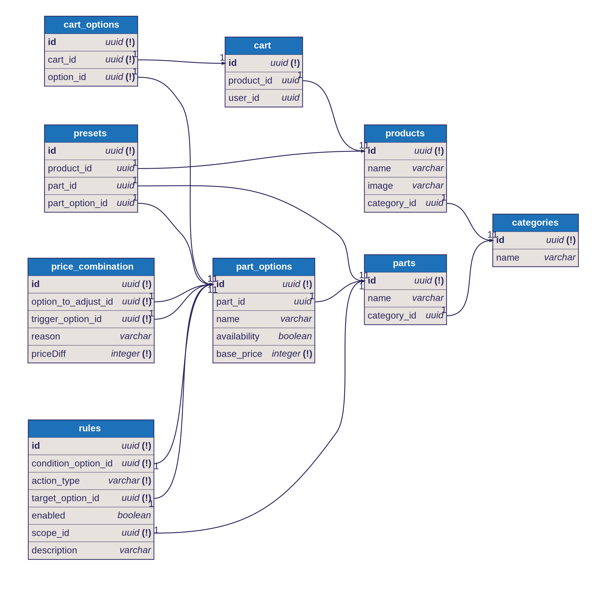
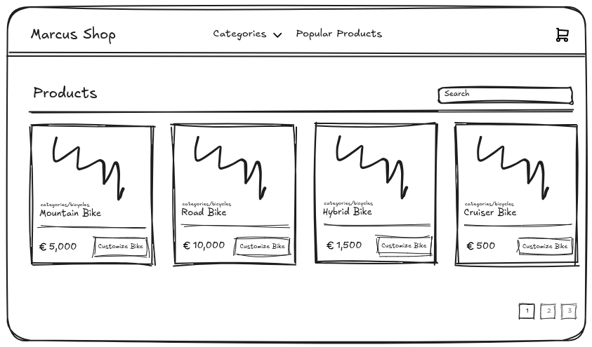
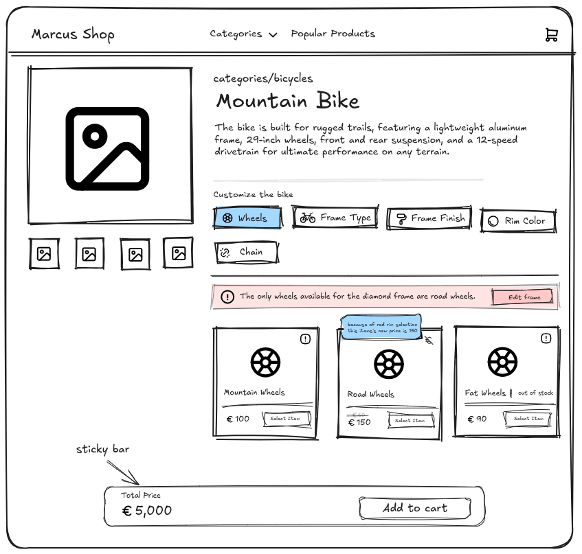
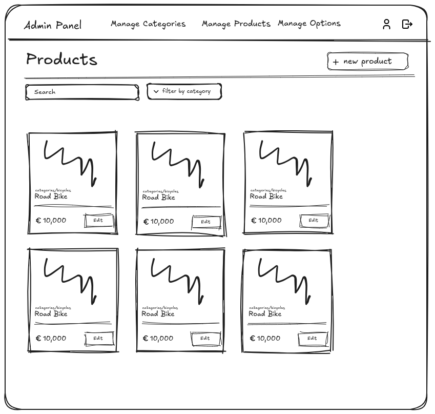
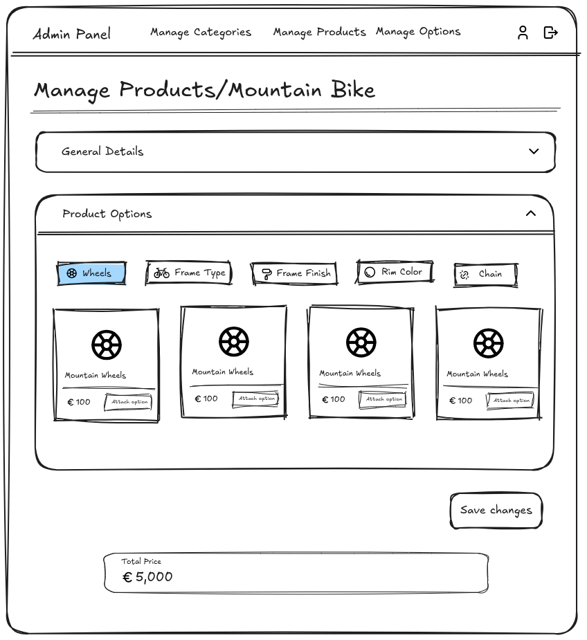
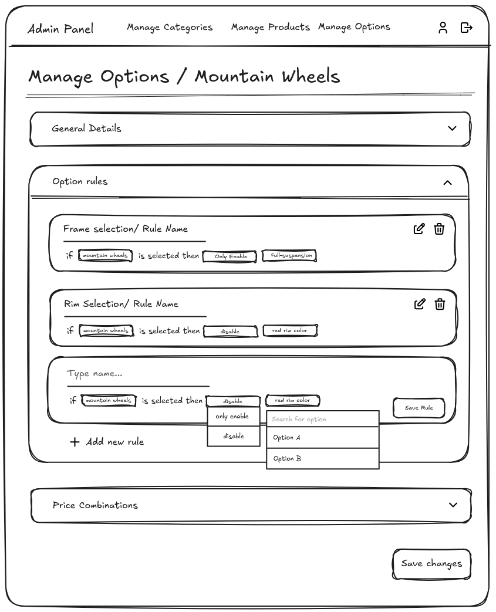
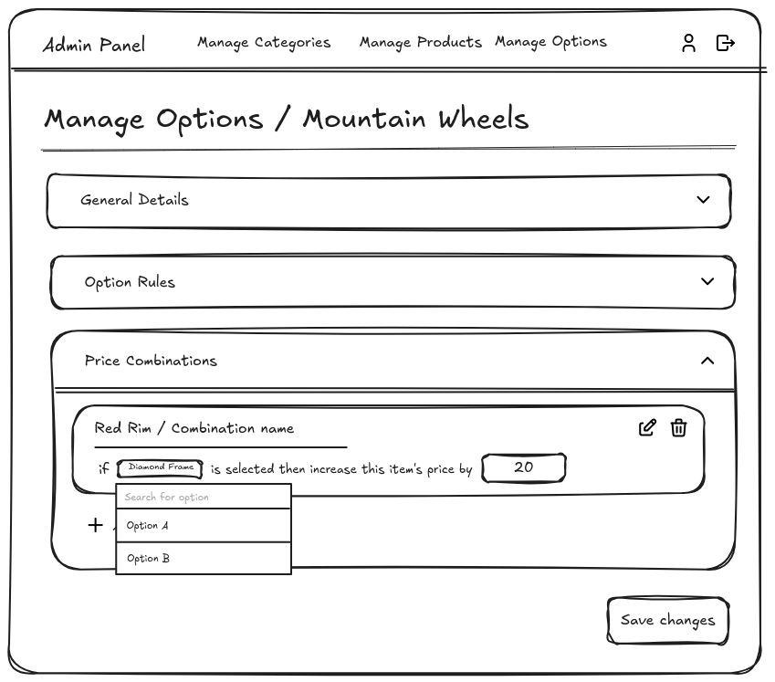

# Data Modeling

Most of my past experiences has been with NoSQL databases, particularly MongoDB, which I consider my comfort zone 😆. However, for this project, I chose PostgreSQL due to the extensive customization needed for both clients and admins. PostgreSQL's relational structure makes it much easier to break down products for admins and manage user customizations in a clear and organized way. Additionally, when structured properly, scaling the app to support more categories would require little to no changes to the data model.

**Note:** I used a PostgreSQL ORM called Drizzle because I didn’t have much experience writing SQL queries in the past. Drizzle made it easier for me to focus more on the app's functionality rather than the complexities of manual query writing.

## Core Model Overview

The database includes the following core tables: **Products**, **Parts**, **Options**, **Categories**, and **Presets**. Each table serves a distinct purpose within the app:

- **Products**: Stores general details about products, such as name, images, and associated categories.
- **Categories**: Establishes the relationship between **products** and **parts**, grouping them under specific categories.
- **Parts**: Contains the core components of a specific **category**. For example, bicycle parts might include frames and wheels.
- **Options**: Represents the customizable or equipable items for specific parts, such as red rims or mountain wheels.
- **Presets**: Stores predefined sets of **options** for specific **parts**, which can later be combined to create a complete **product**. For example, a preset might reference the option used for the wheels and the option used for the frame, among other components.

## Entities Breakdown

**Categories Table**:

| **Field** | **Type**          | **Description**                      |
| --------- | ----------------- | ------------------------------------ |
| `id`      | UUID, Primary Key | Unique identifier for each category. |
| `name`    | VARCHAR           | Category Name (e.g., Bicycles)       |

**Parts Table**:

| **Field**     | **Type**          | **Description**                  |
| ------------- | ----------------- | -------------------------------- |
| `id`          | UUID, Primary Key | Unique identifier for each part. |
| `name`        | VARCHAR           | Part Name (e.g., Frame, Wheels)  |
| `category_id` | UUID, Foreign Key | Links to the category            |

**Part Options Table**:

| **Field**      | **Type**          | **Description**                                       |
| -------------- | ----------------- | ----------------------------------------------------- |
| `id`           | UUID, Primary Key | Unique identifier for each part option.               |
| `name`         | VARCHAR           | Option Name (e.g., Mountain Wheels)                   |
| `part_id`      | UUID, Foreign Key | Links to the part                                     |
| `availability` | BOOLEAN           | Used to check if the option is available for purchase |
| `base_price`   | INTEGER           | Option initial price before modifications             |

**Product Table**:

| **Field**     | **Type**          | **Description**                     |
| ------------- | ----------------- | ----------------------------------- |
| `id`          | UUID, Primary Key | Unique identifier for each product. |
| `name`        | VARCHAR           | Product name (e.g., Mountain Bike)  |
| `image`       | VARCHAR           | Product image URL                   |
| `category_id` | UUID, Foreign Key | Links to the category               |

**Presets Table**:

| **Field**        | **Type**          | **Description**                    |
| ---------------- | ----------------- | ---------------------------------- |
| `id`             | UUID, Primary Key | Unique identifier for each preset. |
| `product_id`     | UUID, Foreign Key | Links to the product               |
| `part_id`        | UUID, Foreign Key | Links to the part                  |
| `part_option_id` | UUID, Foreign Key | Links to the option                |

**Price Combination**:

| **Field**             | **Type**          | **Description**                                                                               |
| --------------------- | ----------------- | --------------------------------------------------------------------------------------------- |
| `id`                  | UUID, Primary Key | Unique identifier for each price combination.                                                 |
| `option_to_adjust_id` | UUID, Foreign Key | Links to the option that it price should be adjusted                                          |
| `trigger_option_id`   | UUID, Foreign Key | Links to the option that should trigger price adjustment for `option_to_adjust_id`            |
| `reason`              | VARCHAR           | A reason to display in the UI prompting the users about the reason behind the price increase. |
| `price_diff`          | INTEGER           | The amount that `option_to_adjust_id` should be increased by.                                 |

**Rules**:

| **Field**             | **Type**          | **Description**                                                                                                     |
| --------------------- | ----------------- | ------------------------------------------------------------------------------------------------------------------- |
| `id`                  | UUID, Primary Key | Unique identifier for each rule.                                                                                    |
| `condition_option_id` | UUID, Foreign Key | Links to the option that triggers the rule.                                                                         |
| `target_option_id`    | UUID, Foreign Key | Links to the option that is affected by this rule.                                                                  |
| `enabled`             | BOOLEAN           | Used to check if the rule is enabled or not.                                                                        |
| `price_diff`          | INTEGER           | The amount that `option_to_adjust_id` should be increased by.                                                       |
| `action_type`         | VARCHAR           | The action type can be either `only_enable` or `disable`. (e.g, `only_enable` `target_option_id` within `scope_id`) |
| `scope_id`            | UUID, Foreign Key | Links to the scope or part that this rule takes action in (e.g: Wheels, Frame)                                      |
| `description`         | VARCHAR           | This field can be displayed on the UI to explain the reason behind the rule activation.                             |

**Cart Table**:

| **Field**    | **Type**          | **Description**                    |
| ------------ | ----------------- | ---------------------------------- |
| `id`         | UUID, Primary Key | Unique identifier for each cart.   |
| `product_id` | UUID, Foreign Key | Links to the selected product.     |
| `user_id`    | UUID, Foreign Key | Links to the user if there is auth |

**Cart Options Table**:

| **Field**   | **Type**          | **Description**                           |
| ----------- | ----------------- | ----------------------------------------- |
| `id`        | UUID, Primary Key | Unique identifier for each cart.          |
| `cart_id`   | UUID, Foreign Key | Links to the cart.                        |
| `option_id` | UUID, Foreign Key | Links to the option attached to the cart. |

# User Actions

Similar to other e-commerce platforms, the key pages that users interact with are the main product listings and the search page. For this app, the envisioned user flow would be as follows:

1. The user visits the homepage where various products are displayed.
2. The user filters the products by the category they are interested in.
3. The user searches for a specific product.
4. The user clicks on a product to view its detailed information.
5. The user customizes the product to meet their specific needs.
6. The user adds the customized product to their cart.
7. Finally, the user proceeds with the payment to complete the purchase.

# Product Page

Once the user accesses a specific product, a request is made to retrieve all the product parts, each paired with its corresponding predefined options.

The options will be grouped under relevant categories. For example, if the product is a bike, the categories could include parts like Wheels, Frame, Rim Color, and Chain. When the user selects a category, a request is sent to the backend with the user's currently selected options. The response will include the options for the selected part, along with a field called `disabled`. This field indicates if the current user's selection violates any rules towards the option.

These rules are defined in the **rules** table, where admins can specify a set of rules for each option. [See Admin Option Rules](#admin-option-rules)

If an option is disabled due to a conflicting selection, a UI alert will notify the user, explaining the reason the option is disabled and providing an action to edit the option causing the conflict.

The price of each option will also adjust based on the user's selections. If an option has a combination with a previously selected option, the price may be affected. A tooltip will appear on the option card, allowing the user to hover over it and understand why the price has changed.

After the user makes a new selection, a request is sent to the back-end to calculate the total price based on the selected options, factoring in any price differences from the price combination table. [See Admin Price Combinations](#admin-price-combinations)

# Add to cart

Once the user clicks the "Add to Cart" button, a request is sent to the back-end, which includes the selected options. These options could either be the predefined options of the product or customizations made by the user.

While validation for the options should generally take place on the front end to prevent users from selecting incompatible or restricted options, the back-end still performs a secondary validation to ensure no rule violations. If the user somehow manages to add an invalid option, the back-end service will handle the error by checking for any violations of the defined rules.

Once validated, the backend will add a row to the **cart** table, linking the product to the user through the product ID and user ID. Additionally, for each individual option, a row will be created in the **cart_options** table, with each row referencing the primary cart item’s ID.

# Admin workflow

Once Marcus accesses the administration portal, he'll be greeted by a dashboard displaying key metrics like sales performance. A navigation bar will be available, allowing him to easily access the pages where he can manage products, categories, and options.

### Product Creation

Upon navigating to the products page, Marcus will see a list of existing products along with a button to create a new product. When clicked, a modal will appear, allowing Marcus to input the general information of the product, such as its name, category, and images.

Creating a new product will add a row to the `products` table with the details entered in the modal, along with a foreign key linking the product to its corresponding category.

Once the form is submitted, Marcus will be redirected to a page to finalize the product setup. This page is divided into several sections:

1. **General Details**: This section displays the previously entered information (name, category, images).
2. **Product Options**: In this section, Marcus can select the options to include for each part of the product.
3. **Dynamic Price Section**: A sticky bar at the bottom of the page will display the total price, updating dynamically based on the selected options.

Upon selecting an option, a new row will be added to the `presets` table, including a foreign key referencing the selected option and another foreign key for the associated product ID.

---

### Options Creation

To create a product, it's essential to have predefined options available for selection. To create a new option Marcus will have navigate to the **Options** page and click the "Create New Option" button. This will trigger a modal where he can fill out the details for the option, including its base price and which part it belongs to.

After submitting, Marcus will be redirected to the options page, which follows a similar structure to the product page but with additional sections such as:

- **Rules**
- **Price Combination**

Creating an option will add a new row to the `part_options` table with the option details, as well as a foreign key that links it to the corresponding part.

---

### Rules

The **Option Rules** section allows Marcus to define exceptions or conditions for when users customize products.

The section displays all defined rules, with a button at the bottom to add a new rule.

When clicking the button, an empty rule form appears where Marcus can define:

- A **rule name**
- A **formula** that states:  
   `If (current option) is selected, then (enable or disable) (target option)`

The "current option" is the option that triggers the rule, and the "target option" is the one affected by the rule. Marcus can select whether the target option should be **disabled** or **enabled** within its specific part using dropdown menus. These options are searchable to help Marcus find the correct one.

After filling out the form, Marcus can click **Save** to create the rule.

Creating a rule will add a new row to the `rules` table with the following fields:

- **conditionOptionId** (the current option)
- **targetOptionId** (the selected target option)
- **actionType** (either "only_enable" or "disable")
- **scopeId** (the part ID of the target option, dynamically assigned)

---

### Price Adjustments

Since Marcus' products are highly customizable, pricing isn’t static, and changes may be necessary to reflect the variations caused by different options. This approach ensures that the products are easily scalable and reduces the need for manual adjustments for each product.

To modify the price of a product, Marcus will edit the prices of the options attached to it. This flexibility allows for dynamic price calculations based on the user’s selections.

In the **Price Combinations** section of the option page, Marcus can create price adjustment rules. Similar to the rule creation process, he can define a formula such as:  
`If (option) is selected, then increase this item's price by (amount)`

When clicking on the option, Marcus can search for a product, and upon selecting it, the price of the current option will be adjusted by the specified amount.

Creating a price combination will add a new row to the `price_combination` table, with foreign keys for the trigger option and the option that will be adjusted if the trigger option is selected, along with the price difference.

### Trade-offs

1. **Queries Optimization**: The reliance on SQL queries and multiple table relationships can lead to performance bottlenecks if queries aren’t optimized as data scales.
2. **Validation Overhead**: Implementing a strong validation system is necessary to ensure data integrity and prevent rule violations but adds complexity to both the frontend and backend.
3. **Complex Admin Flow**: The admin workflow may pose significant challenges in the future, particularly in managing the interface and maintaining consistency across related functionalities. Additional complexities could arise if the admin portal is accessed by multiple administrators, requiring robust role management and coordination.

### Closing

I've thoroughly enjoyed working on this specific challenge and am incredibly grateful for the opportunity to showcase my skills. To the person reviewing this, I hope you find this README clear and easy to follow—I’ve done my best to cover as much as possible. I’m also really looking forward to the next step!
